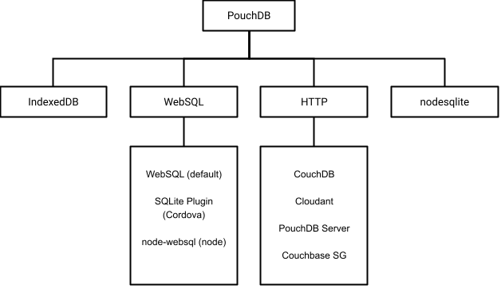

PouchDB is not a self-contained database; it is a CouchDB-style abstraction layer over other databases. By default, PouchDB ships with the [IndexedDB][] adapter for the browser, and a [nodesqlite][] adapter in Node.js. This can be visualized as so:

<object data="static/svg/pouchdb_adapters.svg" type="image/svg+xml">
    
</object>

PouchDB attempts to provide a consistent API that "just works" across every browser and JavaScript environment, and in most cases, you can just use the defaults. However, if you're trying to reach the widest possible audience, or if you want the best performance, then you will sometimes want to tinker with the adapter settings.

#### Topics:
* [PouchDB in the browser](#pouchdb_in_the_browser)
* [PouchDB in Node.js](#pouchdb_in_node_js)
* [PouchDB over HTTP](#pouchdb_over_http)
* [More resources](#more_resources)




In the browser, PouchDB prefers IndexedDB.


Prior to PouchDB 7.0.0, the WebSQL adapter was used for Safari/iOS. The WebSQL adapter no longer ships in PouchDB, but may be installed separately.


If you're ever curious which adapter is being used in a particular browser, you can use the following method:

```js
const pouch = new PouchDB('myDB');
console.log(pouch.adapter); // prints 'idb'
```

### SQLite plugin for Cordova/PhoneGap

On Cordova/PhoneGap/Ionic, the native SQLite database is often a popular choice, because it allows unlimited storage (compared to [IndexedDB/WebSQL storage limits](http://www.html5rocks.com/en/tutorials/offline/quota-research)). It also offers more flexibility in backing up and pre-loading databases, because the SQLite files are directly accessible to app developers.

There are various Cordova plugins that can provide access to native SQLite, such as 
[Cordova-sqlite-storage](https://github.com/litehelpers/Cordova-sqlite-storage),    
[cordova-plugin-sqlite-2](https://github.com/nolanlawson/cordova-plugin-sqlite-2), or 
[cordova-plugin-websql](https://github.com/Microsoft/cordova-plugin-websql).

To use them, you must install them separately into your Cordova application, and then add a special third-party PouchDB adapter
called [pouchdb-adapter-cordova-sqlite](https://github.com/nolanlawson/pouchdb-adapter-cordova-sqlite). Once you do
that, you can use it via:

```js
const db = new PouchDB('myDB.db', {adapter: 'cordova-sqlite'});
```


In PouchDB pre-6.0.0, Cordova SQLite support was available out-of-the-box, but it has been moved to a separate plugin
to reduce confusion and to make it explicit whether you are using WebSQL or Cordova SQLite.


We recommend avoiding Cordova SQLite unless you are hitting the 50MB storage limit in iOS, you 
require native or preloaded access to the database files, or there's some other reason to go native.
The built-in IndexedDB adapter is nearly always more performant and stable.



### Browser adapter plugins

PouchDB also offers separate browser plugins that use backends other than IndexedDB. These plugins fully pass the PouchDB test suite and are rigorously tested in our CI process.

#### Node SQLite adapter

You can also use PouchDB in Node.js' [native SQLite module](https://nodejs.org/api/sqlite.html), when using Node.js' `>22.5.0` version. 

```js
const PouchDB = require('pouchdb');
PouchDB.plugin(require('pouchdb-adapter-node-sqlite'));

const db = new PouchDB('mydatabase.db', {adapter: 'nodesqlite'});
```

#### PouchDB Server

[PouchDB Server](https://github.com/pouchdb/pouchdb-server) is a standalone REST server that implements the CouchDB API, while using a LevelDB-based PouchDB under the hood. It also supports an `--in-memory` mode and any [LevelDOWN][] adapter, which you may find handy.

PouchDB Server passes the PouchDB test suite at 100%, but be aware that it is not as full-featured or battle-tested as CouchDB.

#### PouchDB Express

The underlying module for PouchDB Server, [Express PouchDB](https://github.com/pouchdb/express-pouchdb) is an Express submodule that mimics most of the CouchDB API within your Express application.



The best place to look for information on which browsers support which databases is [caniuse.com](http://caniuse.com).  You can consult their tables on browser support for various backends:

* [IndexedDB](http://caniuse.com/indexeddb)
* [WebSQL](http://caniuse.com/sql-storage)
* [LocalStorage](http://caniuse.com/namevalue-storage)

[IndexedDB]: http://www.w3.org/TR/IndexedDB/
[WebSQL]: http://www.w3.org/TR/webdatabase/
[LocalStorage]: https://developer.mozilla.org/en-US/docs/Web/Guide/API/DOM/Storage
[es5-shims]: https://github.com/es-shims/es5-shim
[sqlite plugin]: https://github.com/brodysoft/Cordova-SQLitePlugin
[sqlite plugin 2]: https://github.com/nolanlawson/cordova-plugin-sqlite-2
[leveldown]: https://github.com/rvagg/node-leveldown
[level-js]: https://github.com/maxogden/level.js
